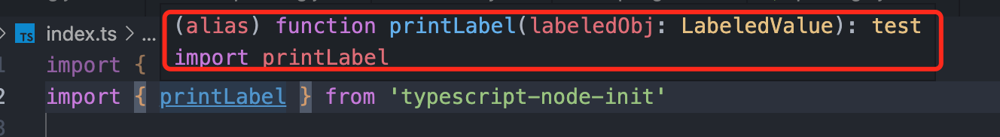

### 使用rollup打包typscript-node项目为第三方库

#### tsc和rollup对比

* tsc是Typescript官方的编译器，本身也具有打包功能，但是其本质只是**编译器**，它适合于打包**直接运行的**大型项目文件，并不适合构建**独立的第三方库或组件**。
* rollup则是**javascript打包器**，它可以将ES6模块打包称单个javascript文件，同时它本身也采用了[Tree Shaking](https://blog.csdn.net/weixin_42089660/article/details/118072554)优化算法，能使得打包文件大小得到进一步的优化。
* 另一方面，rollup支持插件功能，通过设置插件能满足大部分时候的打包需求，在下面即将要讲解的打包中，插件提供了很大的帮助。[RollUp插件集合网站](https://github.com/rollup/awesome)


#### rollup打包流程

#### 本地安装 rollup

* 就我个人而言，不推荐安装全局的rollup包，因为在协同工作时，这样会导致rollup版本**得不到统一而产生打包错误**，所以推荐在本地安装rollup，本文使用的包管理工具为`yarn`，安装命令如下:

```shell
yarn add rollup
```

* 安装完毕后，在`package.json`文件里设置对应的脚本，用于快速启动打包。

```json
// package.json
{
  "scripts": {
    "build": "rollup -c"
  }
}
```

* `-c`的意思是按照配置文件中设置的内容进行打包。

#### 设置rollup.config.js文件

* 就如同`tsconfig.json`一样，rollup也是有一个对应的配置文件名为`rollup.config.js`，虽然其不是必须的，但配置文件强大且方便，所以在配置项目打包时基本都要用到配置文件。
* 在项目根目录创建对应的配置文件，在文件里根据自己的需求来编写对应的配置代码。
* `rollup.config.js`是一个`ES`模块，它会根据文件内导出的内容来进行打包上的设置，如下所示。

```js
// rollup.config.js
export default { // 这里也可以是一个数组
  input: [],
  output: [],
  external: [],
  plugins: [],
  // ....
}
```

#### 安装插件

* 需要三个插件：
  1. [rollup-plugin-typescript2](https://github.com/ezolenko/rollup-plugin-typescript2) => 将typescript转移为javascript的插件
  2. [rollup/plugin-commonjs](https://github.com/rollup/plugins/tree/master/packages/commonjs) => 将commonjs语法转换为es6
  3. [rollup-plugin-dts](https://github.com/Swatinem/rollup-plugin-dts) => 生成声明文件d.ts文件
* 执行以下的命令

```shell
yarn add @rollup/plugin-commonjs rollup-plugin-typescript2 typescript tslib rollup-plugin-dts --dev
```


#### 修改配置文件

* 关于配置文件的各个变量配置这里不赘述，如有需求，可查阅rollup官网的[配置说明](https://www.rollupjs.com/guide/command-line-reference)。

```js
// rollup.config.js

import ts from 'rollup-plugin-typescript2'
import commonjs from '@rollup/plugin-commonjs'
import dts from 'rollup-plugin-dts'

// 打包结果语法遵循EsNext规范
const override = { compilerOptions: { module: 'ESNext' } }

export default [{
    input: 'src/index.ts',
  // 打包两种文件，分别适配commonjs语法和esmodule语法
    output: [{
        file: "dist/index.cjs",
        format: "cjs"
    },
    {
        file: 'dist/index.mjs',
        format: "esm"
    }
    ],
    plugins: [
      // 表明typescript打包遵循该项目的tsconfig.json配置的规则
        ts({
            tsconfig: "tsconfig.json",
            tsconfigOverride: override // 配置复写
        }),
        commonjs()
    ]
}, {
    input: "src/index.ts",
 			// 生成类型文件
    output: {
        file: "dist/index.d.ts",
        format: 'esm'
    },
    external: [],
  // dts插件使用
    plugins: [
        dts({})
    ]
}]
```


#### 配置package.json

* npm会根据package.json里的字段信息去**决定哪些文件要上传至npm官网**，其对应的字段为`files`，如下所示。

```json
// package.json
{
  "files": [
    "dist",
    "*.d.ts"
  ]
}
```

* 同时外界在引用第三方包时，import或require语法会根据package.json中字段的信息去获取对应的代码文件和声明文件。它们对应的字段分别为`main`,`module`和`types`

```json
{
	"main": "dist/index.cjs", // main是commonjs规范时引用的文件 
  "module": "dist/index.mjs", // module是esmodule规范时引用的文件
  "types": "dist/index.d.ts", // types指定声明文件的位置
}
```

* 需要注意`type`字段和`types`字段的区别，前者则是指定当前项目是`commonjs`规范还是`esmoudle`规范，其值有`module`和`commonjs(default)`

* 下面是整个`package.json`的内容

```json
{
  "name": "typescript-node-init",
  "version": "1.0.1",
  "description": "test for rollup",
  "main": "dist/index.cjs",
  "module": "dist/index.mjs",
  "types": "dist/index.d.ts",
  "type": "module",
  "files": [
    "dist",
    "*.d.ts"
  ],
  "scripts": {
    "test": "echo \"Error: no test specified\" && exit 1",
    "build": "rollup -c",
  },
  "keywords": [],
  "author": "Test",
  "license": "ISC",
  "devDependencies": {
    "@rollup/plugin-alias": "^5.0.0",
    "@rollup/plugin-commonjs": "^24.1.0",
    "@rollup/plugin-node-resolve": "^15.0.2",
    "rollup-plugin-dts": "^5.3.0",
    "rollup-plugin-typescript2": "^0.34.1",
    "typescript": "^5.0.4"
  },
  "dependencies": {
    "bump": "^0.2.5",
    "rollup": "^3.21.5",
    "typescript-node-init": "^1.0.1"
  }
}
```

#### 打包并上传至npm

* 当上述一切都完成后，便可以进行打包上传操作了，执行以下命令。

```shell
yarn build # 打包
npm publish # 上传
```

* 上传完毕后，你便可以在其他Ts项目里使用你自己打包上传的第三方库了。



